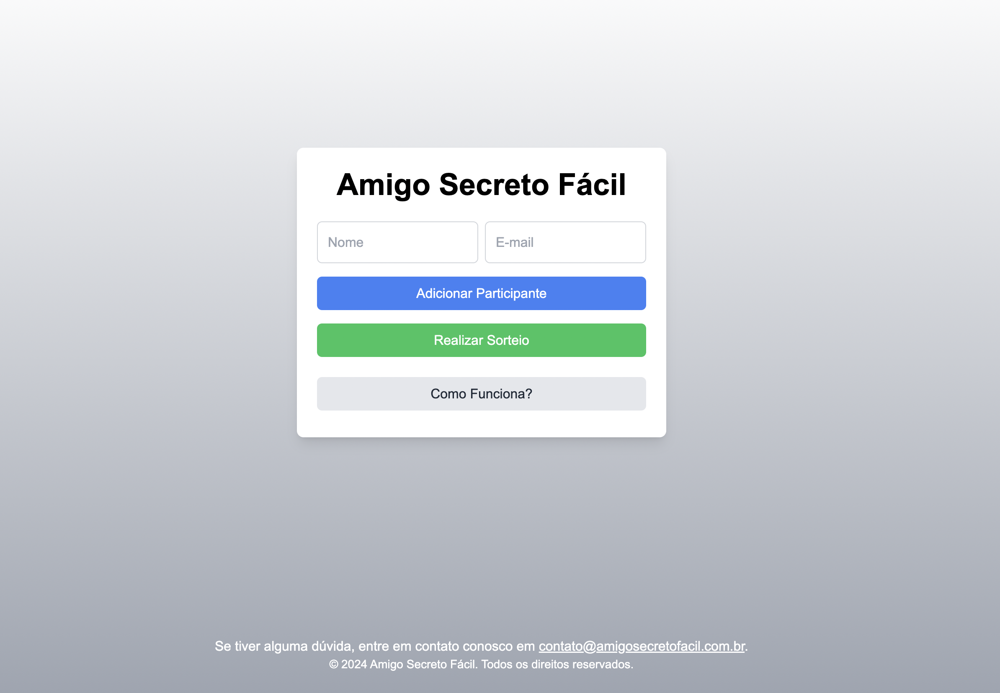
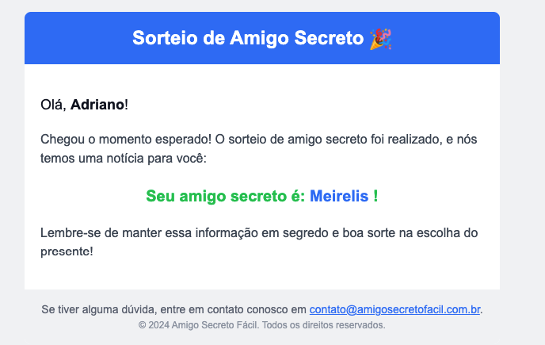

## Objetivo do projeto
MVP de uma plataforma de sorteios de amigo secreto. O sistema é propositalmente manipulado: quando os e-mails teste1@gmail.com e teste2@gmail.com estão incluídos na lista de participantes, ambos serão amigos secretos, independentemente do número total de participantes.

Esse sistema foi usado em uma brincadeira de Natal no Ano Novo de 2024 com minha família, onde manipulei o sorteio para ser o amigo secreto da minha, até então, namorada, com o objetivo de pedi-la em casamento.

### Executando em ambiente de desenvolvimento

```bash
npm run dev
# or
yarn dev
# or
pnpm dev
# or
bun dev
```

Acesse [http://localhost:3000](http://localhost:3000) com o seu navegador para ver o resultado.


### Tecnologias usadas: 
- [Next.js Documentation](https://nextjs.org/docs)
- [Resend](https://resend.com/nextjs) - Envio de e-mails

### Resultado


